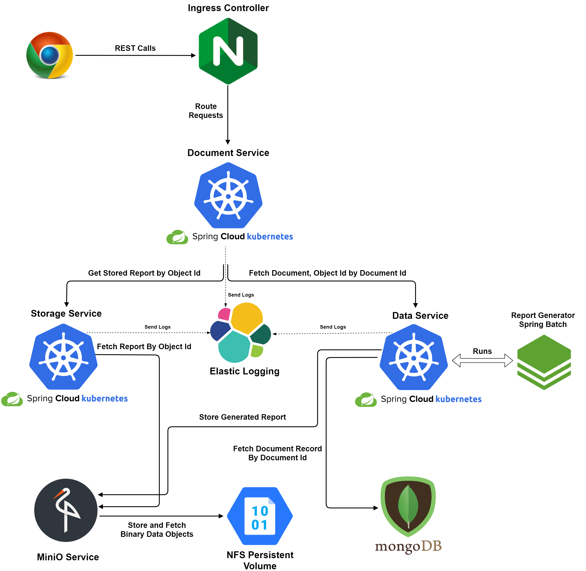

# Spring Kubernetes Micro Services Showcase

[Kubernetes](https://kubernetes.io/docs/concepts/overview/what-is-kubernetes/) is leading orchestration framework which enables automated deployments, scaling, and management of containerized applications.
Spring Kubernetes Micro Services is a showcase application which uses the new [Spring Cloud Kubernetes](https://spring.io/projects/spring-cloud-kubernetes) framework to manage service discovery and is deployed on kubernetes network.
The application provides services to fetch the generated report documents using [Spring Batch](https://spring.io/projects/spring-batch) and stored on a [Minio cloud storage](https://min.io/).
The application has below services.

* [Discovery Service](discovery-service/README.md): Eureka discovery service allows micro services to find and communicate with each other for local testing. Kubernetes uses [Spring Cloud Kubernetes](https://spring.io/projects/spring-cloud-kubernetes) for service discovery.
* [Data Service](data-service/README.md): Data service provides reactive services using Spring WebFlux to store and fetch report document data.
* [Minio Service](minio-service/README.md):  Minio service provides private cloud storage services to store and fetch files.
* [Storage Service](storage-service/README.md): Storage services provide service to fetch files using object id and bucket. 
* [Document Service](document-service/README.md): Document service exposes services to get list of reports for the user and download them using document id. 
* [Elastic Logging](elastic-logging/README.md): ElasticSearch-Beats-Logstash-Kibana provides log storage and management.
* [Ingress Controller](ingress-controller/README.md): Ingress controller is responsible for directing external traffic to corresponding Kubernetes service within the cluster.

   

Follow the below documentation in order to setup this application using Kubernetes.

* [Kubernetes Architecture](http://emprovisetech.blogspot.com/2018/12/kubernetes-container-orchestration-at.html): Blog post discussing Kubernetes concepts, architecture and various commands in depth.
* [Kubernetes Installation](readme/Kubernetes_Installation.md): Setup Kubernetes Master and Worker nodes for [Ubuntu Bionic](http://releases.ubuntu.com/18.04/). Please refer to various documentations online for respective operating systems.
* [Docker Registry](readme/Docker_Registry.md): Docker registry setup is required to distribute docker images to various Kubernetes pods. 
* [Kubernetes Commands](readme/Kubernetes_Commands.md): Kubernetes commands provides some frequently used commands to deploy and delete/clean up Kubernetes services and debug or troubleshoot kubernetes pods.
* [Helm](readme/Helm.md): Helm is the package manager for Kubernetes which assists in installing and managing applications on Kubernetes clusters.
