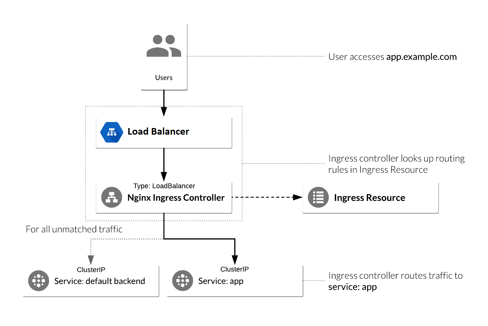

# NGINX Ingress Controller

[Ingress](https://kubernetes.io/docs/concepts/services-networking/ingress/) is a component that routes the  HTTP/HTTPS traffic from outside the cluster to the services and Pods inside the cluster.
Ingress works as a reverse proxy or a load balancer were all external traffic is routed to the Ingress and then is routed to the other components.
Traffic routing is controlled by rules defined on the Ingress resource. Ingress is configured to enable externally-reachable URLs for services, load balance traffic, terminate SSL/TLS, and offer name based virtual hosting.
An Ingress controller is responsible for fulfilling the Ingress, usually with a load balancer.
Ingress frequently uses annotations such as [rewrite-target annotation](https://github.com/kubernetes/ingress-nginx/blob/master/docs/examples/rewrite/README.md) to configure options depending on the Ingress controller.
The Ingress spec contains a list of rules matched against all the incoming HTTP requests. When a host is provided the rules apply to that host else the rule applies to all inbound HTTP traffic through the IP address specified.
The rules contain a list of paths each of which has an associated backend defined with a serviceName and servicePort.
A single default backend is often configured in an Ingress controller to service any requests that do not match a path in the spec.
An Ingress controller is bootstrapped with some load balancing policy settings that it applies to all Ingress, such as the load balancing algorithm, backend weight scheme, while more
advanced concepts such as persistent sessions, dynamic weights is provided through the load balancer used for the Service.
[Ingress controllers](https://kubernetes.io/docs/concepts/services-networking/ingress-controllers/) are not started automatically with a cluster.

There are [many ingress solutions](https://learnk8s.io/kubernetes-ingress-api-gateway/) available such as [Contour](https://github.com/heptio/contour) and [Treafik Ingress](https://docs.traefik.io/user-guide/kubernetes/) which handle HTTP traffic, [Citrix Ingress](https://github.com/citrix/citrix-k8s-ingress-controller) supports TCP/UDP traffic and [HAProxy Ingress](https://github.com/jcmoraisjr/haproxy-ingress) support Websockets. 

The [NGINX Ingress](https://github.com/kubernetes/ingress-nginx) is the most popular Ingress solution and would be setting up as below.
Ingress consists of two components: Ingress resource and Ingress controller. Ingress resource is a collection of rules for the inbound traffic to reach Services.
[Ingress controller](https://devopscube.com/kubernetes-ingress-tutorial/) acts upon the rules set by the Ingress Resource and routes external traffic typically via an HTTP or load balancer.
Ingress controller needs a specific namespace, service account, cluster role bindings, configmaps etc which can be created using the yaml file from [official ingress repo](https://github.com/kubernetes/ingress-nginx/tree/master/deploy).
The routing rules are maintained as Kubernetes ingress object which are baked into pods which enables dynamic configuration of routing rules without redeploying the proxy pods.
An Ingress Resource object is a collection of rules for routing inbound traffic to Kubernetes Services. It can also determines which controller to utilize to serve traffic.
The kind: Ingress dictates it is an Ingress Resource object. Ingress rules are created in same namespace where the services are deployed. The NGINX controller must be exposed for external access. 
This is done using Service type: LoadBalancer or NodePort on the NGINX controller service.
The default backend is a Service which handles all URL paths and hosts the NGINX controller.
 
   

### Setup of NGINX Ingress Controller

Create `ingress` namespace for all resources for [Nginx Ingress controller](https://akomljen.com/kubernetes-nginx-ingress-controller/).

    $ kubectl create namespace ingress
    
Create a default backend endpoint redirects all requests undefined by Ingress rules and default backend service.
    
    $ kubectl create -f default-backend-service.yaml -n=ingress
    
Create a Nginx config to show a VTS page on our load balancer.
    
    $ kubectl create -f nginx-ingress-controller-config-map.yaml -n=ingress
    
Create RBAC rules for Ingress controller.
    
    $ kubectl create -f nginx-ingress-controller-roles.yaml -n=ingress
    
Create Ingress controller.
    
    $ kubectl create -f nginx-ingress-controller-deployment.yaml -n=ingress
    
Define ingress object or Ingress rules for load balancer status page and web applications. The `nginx.ingress.kubernetes.io/rewrite-target: /` annotation redirects requests to the `/`.

    $ kubectl create -f nginx-ingress.yaml -n=ingress
    
Expose `nginx-ingress-lb` deployment for external access which is exposed using NodePort.
    
    $ kubectl create -f nginx-ingress-controller-service.yaml -n=ingress

Describe created ingress object to check the configurations.

    $ kubectl describe ingress  -n ingress