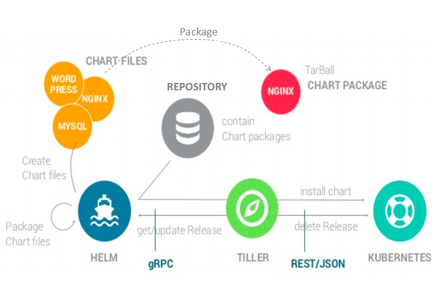

# Helm

Helm is a package manager for Kubernetes that allows developers and operators to more easily configure and deploy applications on Kubernetes clusters.

### Helm Client and Tiller

[Helm](https://www.digitalocean.com/community/tutorials/an-introduction-to-helm-the-package-manager-for-kubernetes) operates with two components, the Helm client software which issues commands to kubernetes cluster and 
Tiller, a server component which runs on kubernetes cluster and receives commands from the Helm client software.
The Helm client software offers commands for listing and searching for charts by keyword, installing applications in the cluster from charts, upgrading or removing applications, and other management functions.
Tiller on other hand is responsible for communicating directly with the Kubernetes API to do the actual work of creating and deleting resources.
Tiller also maintains the state for your Helm releases. Tiller needs service superuser access permissions to install all resource types in all namespaces on the cluster.
This is provided by using a Kubernetes serviceaccount resource which is binded to the **cluster-admin** cluster role.
   

   

### Helm Charts

The components of a Kubernetes application - deployments, services, ingresses, and other objects–are listed in manifest files (YAML file format).
Helm prescribes a common format and directory structure for packaging of pre-configured Kubernetes resources, known as a [Helm chart](https://www.linode.com/docs/applications/containers/kubernetes/how-to-install-apps-on-kubernetes-with-helm/#charts).
Helm chart specifies a file and directory structure as below to be used when packaging kubernetes manifests.

    chart-name/
      Chart.yaml
      LICENSE
      README.md
      requirements.yaml
      values.yaml
      charts/
      templates/
      templates/NOTES.txt
   
| File or Directory  | Description                                                                                          |
| ------------------ | ---------------------------------------------------------------------------------------------------- |
| Chart.yaml         | General information about the chart, including the chart name, a version number, and a description.  |
| LICENSE            | A optional plain-text license file containing licensing information for the chart.                   |
| README.md          | Readme instructions for the user of a chart for installing and using the chart.                      |
| requirements.yaml  | Optional listing of charts that this chart depends on, specifying chart name and version for each dependency. |
| values.yaml        | Default configuration values for the variables in the manifests templates.                           |
| charts/            | A directory which stores chart dependencies files instead of linking them to requirements.yaml file. |
| templates/	     | The directory contains template files that are combined with configuration values (from values.yaml and command line) and rendered into Kubernetes manifests.|
| templates/NOTES.txt| Optional plain-text notes file which will print to a user's terminal when they install the chart.    |

   
Helm provides a [official curated charts repository](https://github.com/helm/charts/) with prepackaged charts for popular open-source software projects.
Helm comes preconfigured with a default chart repository, referred to as **stable** which points to a [Google Storage bucket](https://kubernetes-charts.storage.googleapis.com).
Some of the alternate helm repositories are [Incubator Repo](https://github.com/helm/charts/tree/master/incubator) and [Bitnami Helm Charts repo](https://bitnami.com/stacks/helm).
The helm command can install a chart from a local directory, or from a .tar.gz packaged version of this directory structure. 

### Helm Installation

First we [install](https://www.digitalocean.com/community/tutorials/how-to-install-software-on-kubernetes-clusters-with-the-helm-package-manager) the helm command-line utility on our local machine using script from [Helm’s GitHub repository](https://github.com/helm/helm/releases).
The script would prompt to enter your password and press ENTER.

    $ cd /tmp
    $ curl https://raw.githubusercontent.com/kubernetes/helm/master/scripts/get > install-helm.sh
    $ sudo chmod u+x install-helm.sh
    $ ./install-helm.sh

Next we setup Tiller on kubernetes cluster by first creating tiller serviceaccount.

    $ kubectl -n kube-system create serviceaccount tiller
    
Then bind the tiller serviceaccount to the cluster-admin role:

    $ kubectl create clusterrolebinding tiller --clusterrole cluster-admin --serviceaccount=kube-system:tiller

This can also be achieved by applying below rbac configuration. 

    apiVersion: v1
    kind: ServiceAccount
    metadata:
      name: tiller
      namespace: kube-system
    ---
    apiVersion: rbac.authorization.k8s.io/v1
    kind: ClusterRoleBinding
    metadata:
      name: tiller
    roleRef:
      apiGroup: rbac.authorization.k8s.io
      kind: ClusterRole
      name: cluster-admin
    subjects:
      - kind: ServiceAccount
        name: tiller
        namespace: kube-system

Finally we run `helm init`, which installs Tiller on our cluster, along with some local housekeeping tasks such as downloading the stable repo details.
The --history-max option prevents Helm's historical record of the objects it tracks from growing too large.
A specific tiller version can be installed using `--tiller-image` flag.

    $ helm init --service-account tiller --history-max 200

Verify whether Tiller is running by listing the pods in kube-system namespace, were tiller pods begin with prefix `tiller-deploy-`.

    $ kubectl get pods --namespace kube-system | grep tiller

### Helm Commands

Check current helm version
    
    $ helm version

Run below command to fetch the full list of latest available charts

    $ helm repo update
    
To add new external repository use the `helm repo add` command as below

    $ helm repo add bitnami https://charts.bitnami.com/bitnami
    $ helm repo add incubator https://kubernetes-charts-incubator.storage.googleapis.com/
        
To determine which repositories are registered to the client use below command:

    $ helm repo list 
    
Install the kubernetes-dashboard package from the stable repository, with `--name` option specifying our release.

    $ helm install stable/kubernetes-dashboard --name dashboard-demo

A Helm release is a single deployment of one chart with a specific configuration. Multiple releases of the same chart, each with its own configuration can be deployed.
Similarly install cassandra from bitnami repository with cassandra release.

    $ helm install bitnami/cassandra --name cassandra

Some charts expect configuration values to be passed during installation as below:

    $ helm install -f ghost-config.yaml stable/ghost

To list all releases on the current cluster

    $ helm list

To check the status of the release use the status command:

    $ helm status [RELEASE]

The helm upgrade command is used to upgrade a release with a new or updated chart, or update the it’s configuration options.

    $ helm upgrade [RELEASE] [CHART] [flags]
    $ helm upgrade dashboard-demo stable/kubernetes-dashboard --set fullnameOverride="dashboard"

Use helm rollback to roll back to the first revision of release:

    $ helm rollback dashboard-demo 1

Helm release can be deleted using `helm delete` command:

    $ helm delete [RELEASE]
    $ helm delete dashboard-demo

Although deleted, Helm saves all the revision information in case to re-deploy the release again.
The `helm list` command with the `--deleted` option allows to list all deleted releases.

    $ helm list --deleted

To permanently delete the release and purge all old revisions, use the `--purge` flag with the `helm delete` command:

    $ helm delete [RELEASE] --purge
    
The search command allows to search for a chart by name in all the added repositories, both local and remote:

    $ helm search cassandra

To inspect the chart and get more details use the inspect command

    $ helm inspect stable/ghost

Create a scaffold of a helm chart directory with the files (values.yaml, Chart.yaml) and directory structure (charts/, templates/).

    $ helm create <chart-name>

A chart usually comes with default configuration values in its `values.yaml` file. 
Some values are used to configure Kubernetes primitives, while some may be passed through to the underlying container to configure the application itself.
To dump all of the available configuration values for a chart use the below command.

    $ helm inspect values <chart-name>
    
To remove the tiller installation from the kubernetes cluster use the following command

    $ helm reset
    
To force removing the tiller installation use the `--force` option of reset command

    $ helm reset --force
