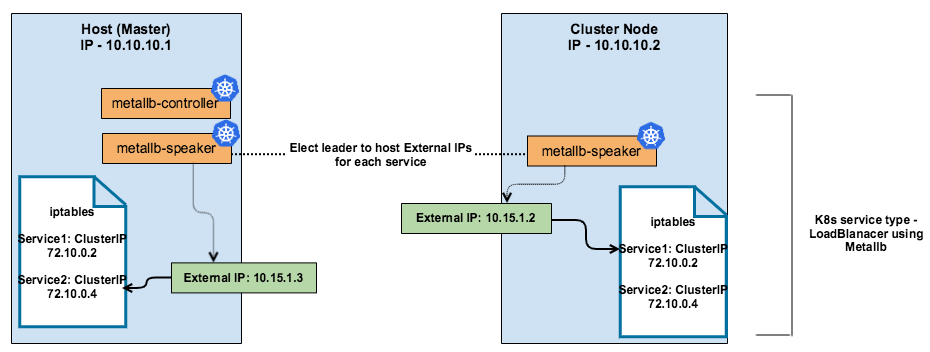

# MetalLB Load Balancer for Bare Metal Kubernetes

Load balancers are available on-demand on cloud environments and a single Kubernetes manifest suffices to provide a single point of contact to the [NGINX Ingress controller](https://kubernetes.github.io/ingress-nginx/deploy/baremetal/) to external clients and, indirectly, to any application running inside the cluster. 
Bare-metal environments lack this commodity, requiring a slightly different setup to offer the same kind of access to external consumers. MetalLB provides a network load-balancer implementation for Kubernetes clusters which don't run on any supported cloud provider, effectively allowing the usage of LoadBalancer Services within any cluster.
[MetalLB](https://metallb.universe.tf/) hooks into the Kubernetes cluster, and provides a network load-balancer implementation thus allowing to create Kubernetes services of type `LoadBalancer` in clusters that don't run on a cloud provider.
It has two features that work together to provide this service: address allocation, and external announcement. [MetalLB](https://www.objectif-libre.com/en/blog/2019/06/11/metallb/) is responsible for address allocation in bare metal cluster. 
Address pools are provided to MetalLB which is used for assigning and unassigning individual addresses as services come and go. Once MetalLB has assigned an external IP address to a service, it needs to redirect the traffic from the external IP to the cluster. MetalLB uses standard routing protocols to achieve this: ARP, NDP, or BGP described below. 

### Layer 2 mode (ARP/NDP)

In layer 2 mode one node within the cluster assumes the responsibility of advertising a service to the local network. 
It is implemented by announcing that the layer 2 address (MAC address) which matches to the external IP is the MAC address of the node. 
For external devices it looks like the node has multiple IP addresses assigned to its network interface. MetalLB runs using two components in layer 2 mode, Cluster-wide controller and Speaker. 
Cluster-wide controller is responsible for receiving allocation requests, while the speaker installed on each node advertises the layer 2 address.
The two main limitations of layer 2 mode are single-node bottleneck and potentially slow failover.

   

### BGP mode

In BGP mode the speakers (nodes) establish a BGP peering sessions with network routers outside the cluster and uses the peering session to advertise the IPs of external cluster services. 
These routers are configured to forward traffic to the service IPs with multi-path support.
Using BGP allows for true load balancing across multiple nodes, and fine-grained traffic control thanks to BGP’s policy mechanisms.
BGP mode adds complexity but it also provides flexibility, scalability and reliability, and widely adopted  standard for peering and exchanging routing information on the internet.

### Installing MetalLB 

To install MetalLB, simply apply the manifest as below:

    $ kubectl apply -f https://raw.githubusercontent.com/google/metallb/v0.8.1/manifests/metallb.yaml

MetalLB maintains a Helm package in the stable package repository and can be installed using Helm as below: 

    $ helm install --name metallb stable/metallb

This creates new pods, namely a `metallb-system/controller` deployment and `metallb-system/speaker` daemonset for each node. The MetalLB controller handles IP address assignments, while the speaker speaks using ARP, NDP, or BGP protocols to make services reachable. 

    $ kubectl get pod -n metallb-system -o wide

MetalLB remains idle until configured. This is accomplished by creating and deploying a configmap into the same namespace (metallb-system) as the deployment.
The [manifests/example-config.yaml](https://raw.githubusercontent.com/google/metallb/v0.8.1/manifests/example-config.yaml) annotated with explanatory comments provides the template for [MetalLB configuration](https://metallb.universe.tf/configuration/).
MetalLB requires a pool of IP addresses defined under `config.address-pools` in order to be able to take ownership of the [ingress Service](https://kubernetes.github.io/ingress-nginx/deploy/baremetal/#a-pure-software-solution-metallb). 
The IP address pool can be composed of the IP addresses of **publicly accessible kubernetes nodes** (excluding master), but IP addresses can also be handed out by a DHCP server.
Below is an example MetalLB configuration to hand out addresses from `192.168.143.230-192.168.143.250` range, using layer 2 mode.

    apiVersion: v1
    kind: ConfigMap
    metadata:
      namespace: metallb-system
      name: config
    data:
      config: |
        address-pools:
          - name: metallb-system
            protocol: layer2
            addresses:
              - 192.168.143.230-192.168.143.250
 
After creating the above ConfigMap, MetalLB takes ownership of one of the IP addresses in the pool and updates the loadBalancer IP field of the ingress-nginx Service.
As soon as MetalLB sets the external IP address of the ingress-nginx LoadBalancer Service, the corresponding entries are created in the iptables NAT table and the node with the selected IP address starts responding to HTTP requests on the ports configured in the LoadBalancer Service.

   

The BGP router configuration requires router IP address for MetalLB, router's AS number, the AS number used by MetalLB. Also IP address range with expressed as a CIDR prefix is required for BGP configuration. 
Below is an example MetalLB BGP mode configuration defines AS number to be used by speakers and the IP address of the remote peers with their AS numbers.
  
    apiVersion: v1
    kind: ConfigMap
    metadata:
      namespace: metallb-system
      name: config
    data:
      config: |
        peers:
        - my-asn: 64500
          peer-asn: 64501
          peer-address: 10.0.0.1
        address-pools:
        - name: metallb-system
          protocol: bgp
          avoid-buggy-ips: true
          addresses:
          - 192.168.10.0/24

### Requesting Specific IPs

MetalLB respects the `spec.loadBalancerIP` parameter, allowing to set up a service with a specific address.
If MetalLB does not own the requested address, or if the address is already in use by another service, assignment will fail and MetalLB will log a warning event visible in `kubectl describe service <service name>`.
MetalLB also supports requesting a specific address pool, if prefer to have a certain kind of address without specific one. 
To request assignment from a specific pool, add the `metallb.universe.tf/address-pool` annotation to the service, with the name of the address pool as the annotation value.

    apiVersion: v1
    kind: Service
    metadata:
      name: nginx
      annotations:
        metallb.universe.tf/address-pool: production-public-ips
    spec:
      ports:
      - port: 80
        targetPort: 80
      selector:
        app: nginx
    
### Testing using NGINX

We setup a NGINX service at port 80 and enable load balancing to be accessed by hosts specified in `address-pool` as below 
similar to [Example NGINX Config](https://raw.githubusercontent.com/google/metallb/v0.8.1/manifests/tutorial-2.yaml).

    apiVersion: apps/v1beta2
    kind: Deployment
    metadata:
      name: nginx
    spec:
      selector:
        matchLabels:
          app: nginx
      template:
        metadata:
          labels:
            app: nginx
        spec:
          containers:
          - name: nginx
            image: nginx:1
            ports:
            - name: http
              containerPort: 80
    
    ---
    apiVersion: v1
    kind: Service
    metadata:
      name: nginx
      annotations:
        metallb.universe.tf/address-pool: production-public-ips
    spec:
      ports:
      - name: http
        port: 80
        protocol: TCP
        targetPort: 80
      selector:
        app: nginx
      type: LoadBalancer

Below command lists the details of nginx LoadBalancer Service.

    $ kubectl get svc

